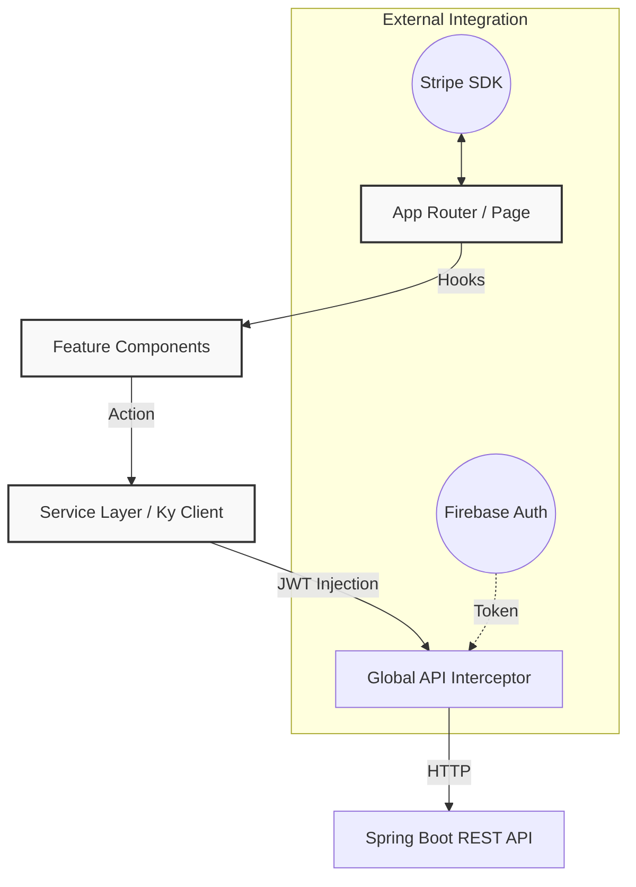

# FSSE2510 Project Frontend


This project focuses on implementing a modern shopping experience with modular architecture and cloud-integrated services.

🔴 Live Demo: [https://johnmak.store](https://johnmak.store)

---

## Technical Design Focus
*Key technical implementations and architectural choices:*

*   **Modular Organization:** Adopts a **Feature-Based Module System** (`src/features`) to maintain code clarity and separation of concerns across domains (Admin, Shop, Account).
*   **Stateful UI Orchestration:** Implements an authenticated cart strategy using **Zustand** for synchronized UI state, featuring **Optimistic Updates** to provide a zero-latency experience with automatic error rollbacks.
*   **API Management:** Utilizes a centralized **Ky** client for consistent networking, including basic Firebase token handling and global error interceptors.

---

## Key Features

- **Membership Ecosystem**: Implements tiered benefits (Bronze to Diamond) with dynamic reward logic and admin-configurable settings.
- **URL-Synchronized Catalog**: Advanced product filtering and sorting using `nuqs`. Synchronizes UI state (categories, price ranges, sort order) with the URL for shareable, reproducible discovery experiences.
- **Engineered Shopping Flow**: Real-time cart state management with **Optimistic UI** orchestration, ensuring immediate feedback for item additions and updates while handling server-side synchronization in the background.
- **Secure Integration**: End-to-end checkout powered by the **Stripe API** and identity management via **Firebase Auth**.
- **Management Dashboard**: Administrative interfaces for handling product data, coupon lifecycles, and site-wide promotional rules.

---

## Architecture & Data Flow



### Directory Structure
```text
src/
├── app/             # Routing and Global Layouts
├── features/        # Modular domains (Admin, Auth, Cart, Home, Product)
├── services/        # Centralized API logic (api-client.ts)
├── lib/             # Third-party configurations (Firebase, GSAP)
└── types/           # Collective Type Definitions
```

---

## The "Why" Behind the Stack
| Technology | Reasoning |
| :--- | :--- |
| **Next.js 16 (App Router)** | Used for Server Components and SEO optimization while maintaining a lean client footprint. |
| **Tailwind CSS 4** | Chosen for rapid, maintainable design implementations using a modern utility-first approach. |
| **TanStack Query** | Simplifies server-state synchronization and implements robust caching out-of-the-box. |
| **Zustand** | Provides a lightweight solution for managing essential persistent client state (Cart, User). |

---

## Core Engineering Domains

### Networking & Auth
The `api-client.ts` layer provides several essential utilities:
*   **Token Injection**: Handles the retrieval and injection of Firebase ID tokens into outgoing requests.
*   **Unauthorized Handling**: Monitors for 401 errors to trigger appropriate global authentication responses.
*   **Error Management**: Extracts structured error details from the backend to provide informative feedback to the user.

### Deployment (AWS)
This project is hosted using a production-aligned AWS workflow:
*   **CI/CD Pipeline**: Integrated with **AWS Amplify** for automated builds and deployment consistency.
*   **Global Delivery**: Leverages **Amazon CloudFront** for content delivery and edge-level SSL termination.
*   **Secure Networking**: Configured with **AWS ACM** for SSL/TLS management and enforced **HTTPS** redirection.

---

## Getting Started

1.  **Environment**: Create `.env.local` based on `.env.example` with your Firebase and Stripe keys.
2.  **Dependencies**: Run `npm ci`.
3.  **Run**: Execute `npm run dev`.

---

## Author
**John Mak**
