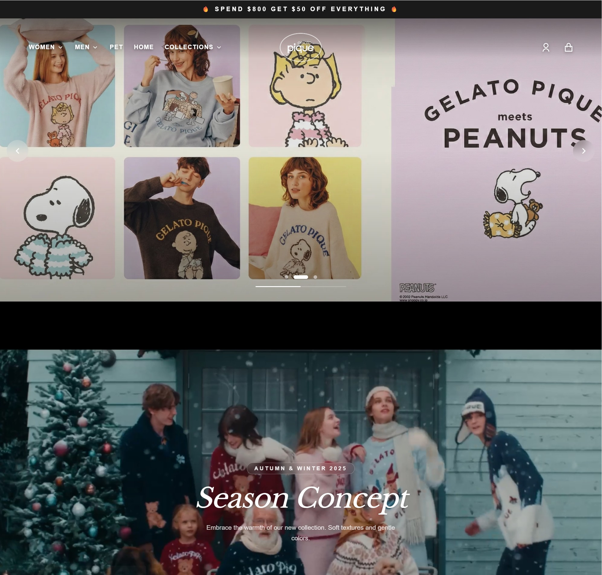

# FSSE2510 Project E-Commerce Frontend 🎨

## 📖 Introduction
This repository contains the frontend implementation for the FSSE2510 E-Commerce course project. Built with Next.js 15 (App Router) and React Server Components, it aims to explore modern web development practices including Server-Side Rendering (SSR) and building interactive Single-Page Applications (SPA) for the Admin panel.

**🚀 Live Demo:** [https://johnmak.store](https://johnmak.store)

### 📸 Screenshot

### 🌟 Project Features
*   **Product Browsing**: Infinite scrolling implementation using URL query parameters.
*   **State Management**: Exploring optimistic UI updates using React Query for shopping cart and wishlist actions.
*   **Storefront & Admin Integration**: Building both a customer-facing shop and a basic Admin Dashboard to manage data.
*   **UI Implementation**: Utilizing Tailwind CSS v4 and shadcn/ui to focus on functional design and consistent styling.

## 📚 Official Documentation

The frontend architecture and implementation details are fully documented in the `docs` directory. Click the links below to view the documentation directly on GitHub:

### Architecture & Components
1. [Frontend Architecture](./docs/01-Frontend-Architecture.md)
2. [UI Components & Design System](./docs/02-Frontend-Components.md)
3. [State & Data Flow](./docs/03-State-Data-Flow.md)

### Requirements & Workflows
4. [Frontend Use Cases](./docs/04-Frontend-UseCases.md)
5. [Frontend BRD & FSD Mapping](./docs/06-Frontend-BRD-FSD.md)

### Quality Assurance (QA)
6. [Frontend Test Cases](./docs/05-Frontend-TestCases.md)
7. [Frontend Definition of Done (DoD)](./docs/07-Frontend-DoD.md)

## 🛠️ Tech Stack & Architecture

### Core Frameworks
*   **Framework**: Next.js 15 (App Router)
*   **Library**: React 19
*   **Language**: TypeScript

### Styling & UI
*   **CSS Framework**: Tailwind CSS v4
*   **Component Library**: shadcn/ui (Radix UI Primitives)
*   **Icons & Animations**: Lucide-React, Framer Motion

### State Management & Data Fetching
*   **Server State (Caching/Fetching)**: TanStack React Query v5
*   **Client Global State**: Zustand
*   **URL State (Search/Filters)**: Nuqs

### Forms & Validation
*   **Form Handling**: React Hook Form
*   **Schema Validation**: Zod

### Deployment & Testing
*   **Hosting**: Vercel
*   **Testing**: Jest (Unit), Playwright (E2E)

---
*Created for FSSE2510 E-Commerce Project Setup Phase.*
