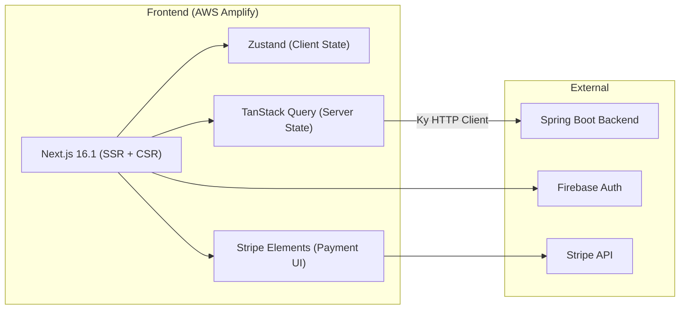
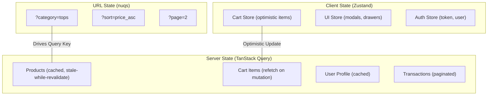

# Frontend Architecture — Gelato Pique E-Commerce

> **Version:** 2.0 | **Date:** 2026-03-18 | **Framework:** Next.js 16.1

---

## 1. High-Level Architecture



---

## 2. Technology Stack

| Technology | Version | Purpose |
|:---|:---|:---|
| Next.js | 16.1 | React Framework (SSR + App Router) |
| React | 19 | UI Library |
| TypeScript | 5.x | Type-safe JavaScript |
| Zustand | — | Client-side State Management |
| TanStack Query | — | Server State + Data Fetching |
| Ky | — | HTTP Client (fetch wrapper) |
| nuqs | — | URL Query Parameter Sync |
| Stripe.js + Elements | — | Payment UI Components |
| Firebase Auth SDK | — | Google SSO Authentication |
| Framer Motion | — | Animations |
| Tailwind CSS | — | Utility-first CSS |

---

## 3. Feature-Sliced Design (FSD) Structure

```
src/
├── app/                    # Next.js App Router (Pages + Layouts)
│   ├── (public)/           # Public pages (shop, product, home)
│   ├── (auth)/             # Auth-protected pages (cart, checkout, account)
│   ├── admin/              # Admin dashboard pages
│   └── layout.tsx          # Root layout with providers
│
├── features/               # Feature modules (business logic)
│   ├── auth/               # Authentication (Firebase login/logout)
│   ├── cart/               # Cart management (Zustand + API)
│   ├── checkout/           # Checkout flow (Stripe integration)
│   ├── product/            # Product display + discovery
│   ├── wishlist/           # Wishlist toggle
│   ├── membership/         # Membership tier display
│   └── admin/              # Admin CRUD features
│
├── shared/                 # Shared utilities & components
│   ├── api/                # Ky client instance, interceptors
│   ├── components/         # Reusable UI components
│   ├── hooks/              # Custom React hooks
│   ├── types/              # TypeScript interfaces/types
│   └── utils/              # Helper functions
│
└── providers/              # Context providers (Auth, Query, Theme)
```

---

## 4. State Management Architecture



**Principles:**
- **Zustand** handles ephemeral UI state & optimistic updates
- **TanStack Query** handles all server data with auto-caching & refetch
- **nuqs** syncs search/filter state to URL → shareable, bookmarkable

---

## 5. Data Fetching Pattern

```typescript
// Ky Client with JWT Injection
const api = ky.create({
  prefixUrl: process.env.NEXT_PUBLIC_API_BASE_URL,
  hooks: {
    beforeRequest: [
      (request) => {
        const token = getFirebaseToken();
        if (token) {
          request.headers.set('Authorization', `Bearer ${token}`);
        }
      }
    ]
  }
});

// TanStack Query Usage
const { data, isLoading } = useQuery({
  queryKey: ['products', { category, sort, page }],
  queryFn: () => api.get('public/products', { searchParams }).json(),
  staleTime: 5 * 60 * 1000, // 5 min cache
});
```

---

## 6. Key Frontend Design Patterns

### 6.1 Optimistic UI (Cart)
- Zustand store updates immediately on user action
- API call fires in background
- On success: TanStack Query cache invalidated, data syncs
- On failure: Zustand rollback + error toast notification

### 6.2 URL-Synchronized Filtering (nuqs)
- All product filters (category, sort, page) stored in URL query params
- URL changes trigger TanStack Query refetch via query key
- Users can share/bookmark filtered views

### 6.3 Firebase Auth Integration
- `signInWithPopup(GoogleAuthProvider)` for login
- JWT token stored in memory (Zustand), never localStorage
- Token auto-refreshes via Firebase SDK
- All API calls inject token via Ky `beforeRequest` hook
