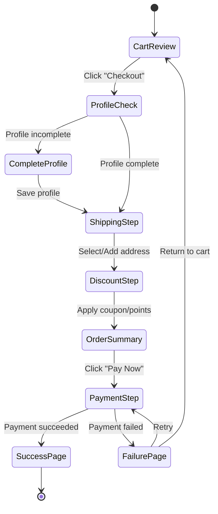

# Checkout Flow — Frontend

> **Version:** 2.0 | **Date:** 2026-03-18

---

## Flow Overview



---

## Step 1: Cart Review

**Route:** `/cart`

| Element | Description |
|:---|:---|
| Product List | Each item shows: image, name, variant (size/color), unit price, quantity control, subtotal |
| Quantity Control | +/- buttons with API sync; minimum 1, maximum = available stock |
| Remove Item | "×" button with confirmation |
| Cart Total | Running total at bottom |
| Empty State | "Your cart is empty" with link to shop |
| Checkout Button | Disabled if cart is empty; redirects to checkout page |

---

## Step 2: Profile Completion Check

**Route:** `/checkout` (gate check)

- System checks if user's `isInfoComplete` is true (name + phone required)
- If incomplete: show profile completion form before proceeding
- If complete: skip directly to shipping step

---

## Step 3: Shipping Address Selection

**Route:** `/checkout` (shipping section)

| Element | Description |
|:---|:---|
| Saved Addresses | Radio buttons for each saved address; default pre-selected |
| Add New Address | "+" button opens address form (recipient, phone, address fields) |
| Address Form | Fields: recipient name, phone, address line 1, address line 2, city, state, postal code |
| Save & Select | New address saved via API and auto-selected |

---

## Step 4: Discounts (Coupon + Points)

**Route:** `/checkout` (discount section)

### Coupon Application
| Element | Description |
|:---|:---|
| Coupon Input | Text input + "Apply" button |
| Validation | API call to `/public/coupon/validate?code=X` |
| Success | Green badge: "20% off applied!" + discount line item |
| Error | Red text below input: "Coupon expired" / "Minimum spend not met" |
| Remove | "×" button to clear applied coupon |

### Points Redemption (Members Only)
| Element | Description |
|:---|:---|
| Points Balance | Shows available points (e.g., "500 points available") |
| Points Input | Number input, max = min(available points, afterCoupon total) |
| Live Recalculation | Total updates in real-time as user adjusts points |

### Discount Stacking Display
```
Subtotal:              $200.00
Coupon (SAVE20 -20%):  -$40.00
Points Redeemed (30):  -$30.00
─────────────────────────────
Order Total:           $130.00
```

---

## Step 5: Order Summary & Payment

**Route:** `/checkout` (payment section)

### Order Summary
- List of all items with snapshots
- Shipping address (selected)
- Discount breakdown
- Final total

### Payment (Stripe Elements)
| Element | Description |
|:---|:---|
| Payment Element | Stripe's pre-built card input component |
| "Pay Now" Button | Triggers `stripe.confirmPayment()` |
| Loading State | Full-page overlay with spinner + "Processing payment..." |
| Warning | "Do not close this page during payment" |

### Payment Flow Sequence
```
1. Click "Pay Now"
2. POST /transactions → create transaction (PREPARE)
3. POST /transactions/{tid}/payment → get clientSecret
4. stripe.confirmPayment({ clientSecret })
5a. Success → PATCH /transactions/{tid}/processing → redirect to success
5b. Failure → PATCH /transactions/{tid}/fail → show error
```

---

## Step 6: Result Pages

### Success Page (`/checkout/success`)
| Element | Description |
|:---|:---|
| Confirmation Icon | Green checkmark animation |
| Order ID | Transaction ID for reference |
| Order Summary | Items purchased, total paid |
| Points Earned | "You earned 26 points!" |
| Actions | "Continue Shopping" button, "View Order" link |

### Failure Page (`/checkout/failure`)
| Element | Description |
|:---|:---|
| Error Icon | Red × with error message |
| Error Detail | "Payment was declined. Please try again." |
| Actions | "Try Again" (returns to payment), "Return to Cart" |
