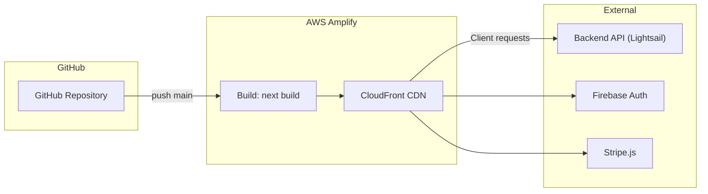

# Deployment Guide — Frontend

> **Version:** 2.0 | **Date:** 2026-03-18 | **Platform:** AWS Amplify

---

## Architecture Overview



---

## 1. CI/CD Pipeline

1. `push` to `main` triggers AWS Amplify auto-build
2. Amplify runs `npm ci && npm run build`
3. Build output deployed to CloudFront edge locations
4. Automatic rollback on build failure

---

## 2. amplify.yml Configuration

```yaml
version: 1
frontend:
  phases:
    preBuild:
      commands:
        - npm ci
    build:
      commands:
        - npm run build
  artifacts:
    baseDirectory: .next
    files:
      - '**/*'
  cache:
    paths:
      - node_modules/**/*
      - .next/cache/**/*
```

---

## 3. Environment Variables

| Variable | Description | Example |
|:---|:---|:---|
| `NEXT_PUBLIC_API_BASE_URL` | Backend API base URL | `https://api.johnmak.store` |
| `NEXT_PUBLIC_FIREBASE_API_KEY` | Firebase project API key | `AIza...` |
| `NEXT_PUBLIC_FIREBASE_AUTH_DOMAIN` | Firebase Auth domain | `project.firebaseapp.com` |
| `NEXT_PUBLIC_FIREBASE_PROJECT_ID` | Firebase project ID | `gelato-pique-store` |
| `NEXT_PUBLIC_STRIPE_PUBLISHABLE_KEY` | Stripe publishable key | `pk_live_...` |

> **Note:** All frontend env vars use `NEXT_PUBLIC_` prefix (exposed to browser). Never put secret keys here.

---

## 4. Local Development Setup

```bash
# 1. Clone the repository
git clone https://github.com/johnmak101-ops/Fsse2510Frontend.git
cd Fsse2510Frontend

# 2. Install dependencies
npm install

# 3. Create .env.local
cp .env.example .env.local
# Fill in your environment variables

# 4. Start development server
npm run dev

# App runs on http://localhost:3000
```

---

## 5. Build Verification

```bash
# Production build
npm run build

# Check bundle size
# Look for "First Load JS shared by all" in build output
# Target: < 300KB gzipped

# Run production locally
npm start
```

---

## 6. Troubleshooting

| Issue | Cause | Solution |
|:---|:---|:---|
| CORS errors in browser | Backend `APP_FRONTEND_URL` mismatch | Ensure backend env matches Amplify domain |
| Firebase Auth popup blocked | Browser popup blocker | Advise user to allow popups for the domain |
| Stripe Elements not rendering | Invalid publishable key | Check `NEXT_PUBLIC_STRIPE_PUBLISHABLE_KEY` |
| Build fails on Amplify | Node version mismatch | Set Node 20.x in Amplify build settings |
| Hydration mismatch warnings | Server/client HTML differs | Ensure no `window`-dependent logic in SSR |
