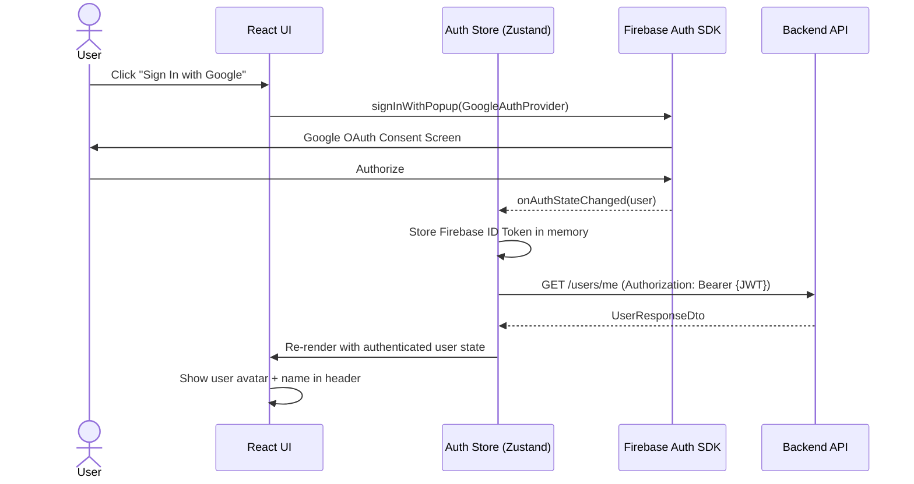
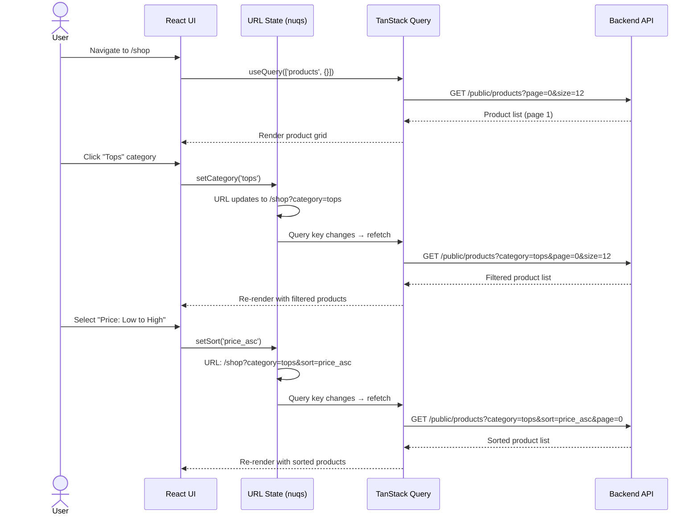
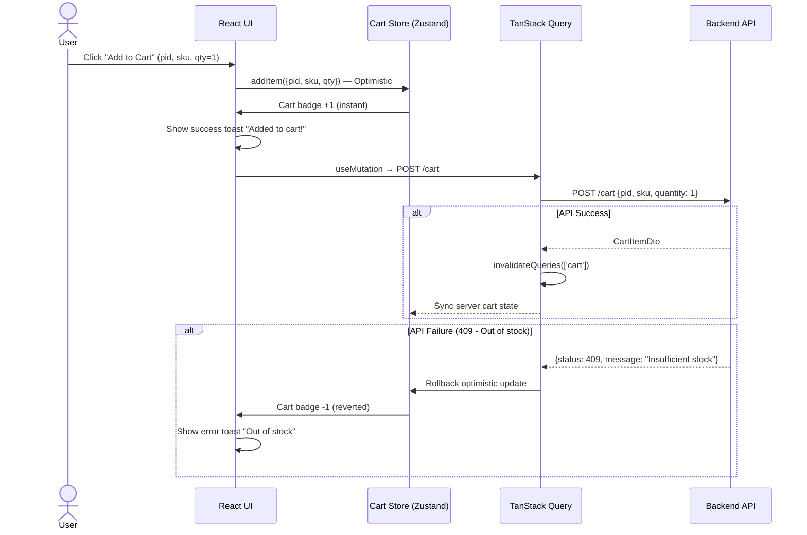
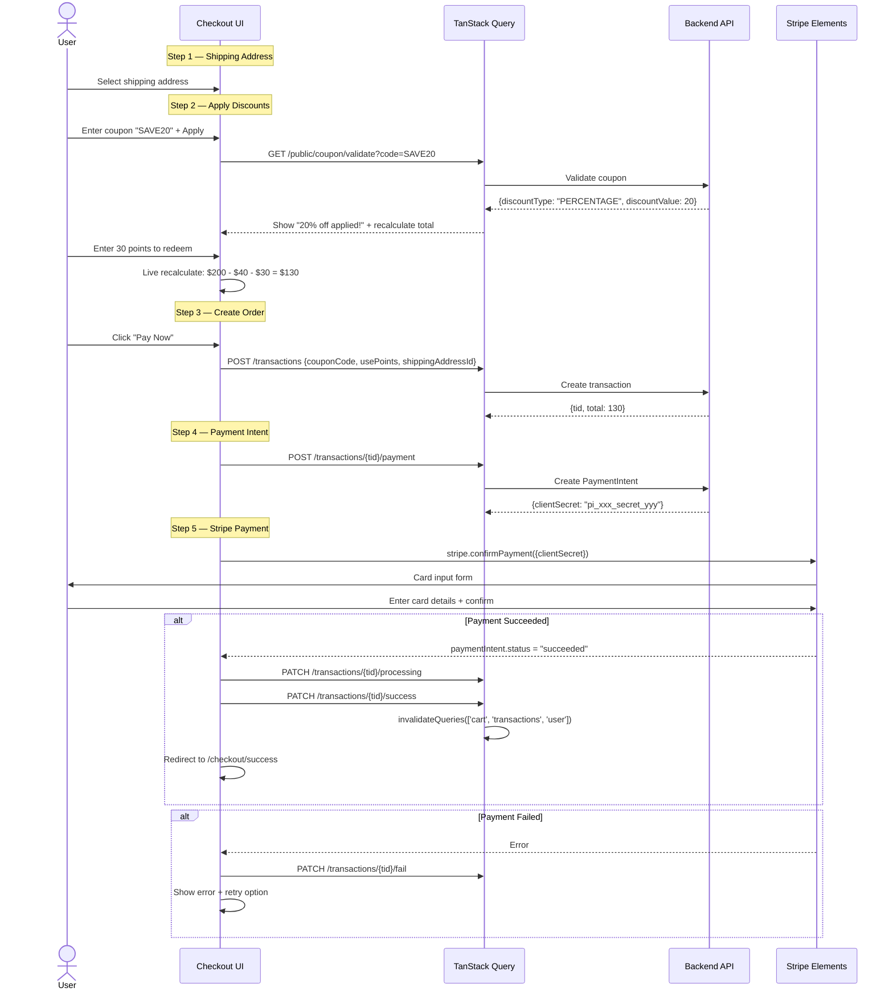
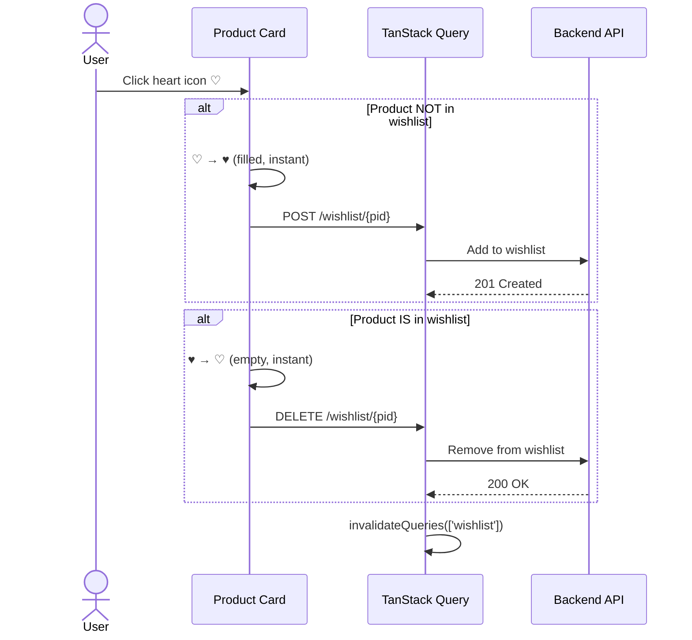
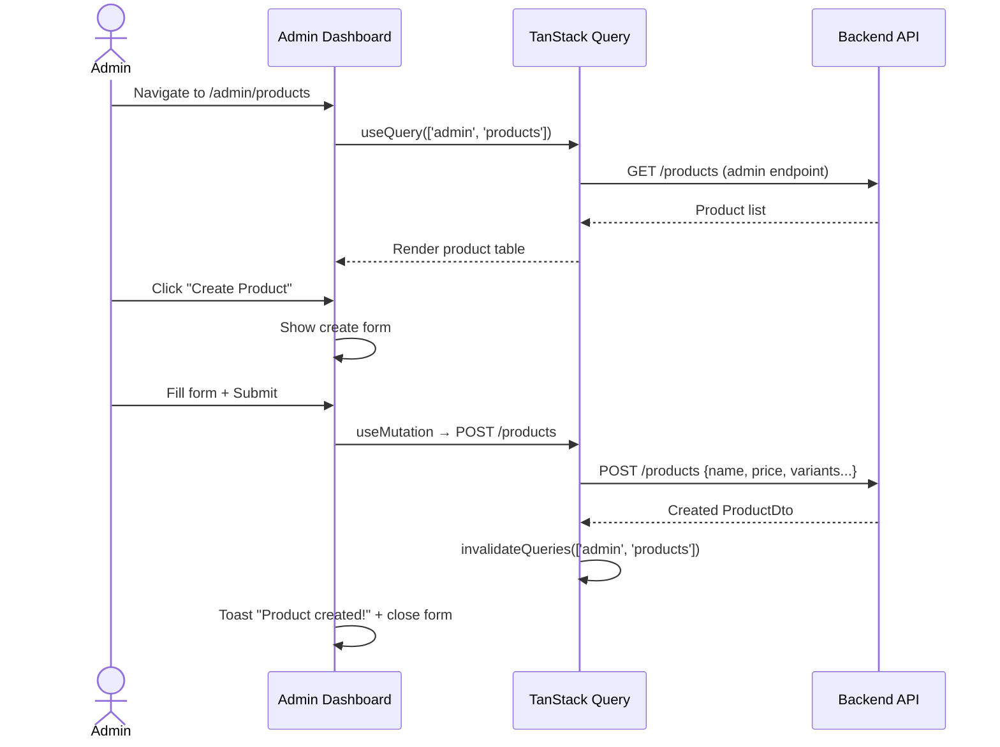

# Sequence Diagrams — Frontend Key Flows

> **Version:** 2.0 | **Date:** 2026-03-18

---

## 1. User Authentication Flow (Frontend Perspective)

---

## 2. Product Browsing with URL Filters

---

## 3. Optimistic Add-to-Cart Flow

---

## 4. Checkout & Payment Flow (Frontend Perspective)

---

## 5. Wishlist Toggle Flow

---

## 6. Admin Product Management Flow

