# Use Cases — Frontend

> **Version:** 2.0 | **Date:** 2026-03-18

---

## Actors

| Actor | Description |
|:---|:---|
| **Visitor** | Unauthenticated user browsing the store |
| **Shopper** | Authenticated user (logged in via Google) |
| **Member** | Shopper with membership tier (BRONZE+) |
| **Admin** | User with admin role (admin dashboard access) |

---

## Use Case Diagram

```mermaid
graph TB
    subgraph Actors
        V["👤 Visitor"]
        S["🛒 Shopper"]
        M["⭐ Member"]
        A["🔧 Admin"]
    end

    subgraph "Browse & Discover"
        UC1["View Homepage"]
        UC2["Browse Products"]
        UC3["Filter & Sort Products"]
        UC4["Search Products"]
        UC5["View Product Details"]
    end

    subgraph "Shopping"
        UC6["Add to Cart"]
        UC7["Manage Cart"]
        UC8["Toggle Wishlist"]
    end

    subgraph "Checkout"
        UC9["Select Shipping Address"]
        UC10["Apply Coupon"]
        UC11["Redeem Points"]
        UC12["Enter Payment"]
        UC13["View Order Confirmation"]
    end

    subgraph "Account"
        UC14["Sign In with Google"]
        UC15["Complete Profile"]
        UC16["View Order History"]
        UC17["Manage Addresses"]
        UC18["View Membership Status"]
    end

    subgraph "Admin Dashboard"
        UC19["Manage Products"]
        UC20["Manage Coupons"]
        UC21["Manage Promotions"]
        UC22["View Transactions"]
        UC23["Manage Users"]
    end

    V --> UC1
    V --> UC2
    V --> UC3
    V --> UC4
    V --> UC5
    V --> UC14
    S --> UC6
    S --> UC7
    S --> UC8
    S --> UC9
    S --> UC10
    S --> UC12
    S --> UC13
    S --> UC15
    S --> UC16
    S --> UC17
    M --> UC11
    M --> UC18
    A --> UC19
    A --> UC20
    A --> UC21
    A --> UC22
    A --> UC23
```

---

## UC-01: View Homepage

| Field | Detail |
|:---|:---|
| **Actor** | Visitor |
| **Trigger** | User navigates to `/` |
| **Main Flow** | 1. Page loads with hero banner 2. Featured products section renders 3. Showcase collections render with banners 4. Navigation bar loads dynamically from API |
| **UI Response** | Skeleton loaders while data fetches; smooth fade-in on load |

---

## UC-02: Browse Products with Filters

| Field | Detail |
|:---|:---|
| **Actor** | Visitor |
| **Trigger** | User navigates to `/shop` |
| **Main Flow** | 1. Product grid loads with default sort (newest) 2. Category sidebar shows available categories 3. User clicks "Tops" → URL updates to `?category=tops` 4. Grid reloads with filtered results 5. User selects "Price: Low to High" → URL adds `&sort=price_asc` 6. User scrolls → infinite scroll or pagination loads next page |
| **Alt Flow** | Zero results → "No products found" message with clear filters button |
| **UX Detail** | All changes sync to URL (shareable); browser back/forward works |

---

## UC-06: Add to Cart (Optimistic)

| Field | Detail |
|:---|:---|
| **Actor** | Shopper |
| **Trigger** | User clicks "Add to Cart" on product card or detail page |
| **Main Flow** | 1. User selects size/color variant 2. Click "Add to Cart" 3. UI immediately updates (cart badge +1, toast: "Added!") 4. API POST /cart fires in background 5. On success: TanStack Query cache syncs |
| **Alt Flow A** | API returns 409 (out of stock) → Zustand rollback, cart badge reverts, error toast |
| **Alt Flow B** | Same SKU already in cart → quantity increments |
| **UX Detail** | Button shows loading spinner during API call; disabled while processing |

---

## UC-10: Apply Coupon

| Field | Detail |
|:---|:---|
| **Actor** | Shopper |
| **Trigger** | User enters coupon code on checkout page |
| **Main Flow** | 1. User types coupon code (e.g., "SAVE20") 2. Clicks "Apply" 3. API validates coupon 4. On valid: green badge "20% off applied!", total recalculates 5. Discount displayed as line item in order summary |
| **Alt Flow** | Invalid/expired coupon → red error message below input |

---

## UC-12: Enter Payment (Stripe)

| Field | Detail |
|:---|:---|
| **Actor** | Shopper |
| **Trigger** | User confirms order and reaches payment step |
| **Main Flow** | 1. API creates transaction → returns `clientSecret` 2. Stripe Payment Element renders (card input) 3. User enters card details 4. Click "Pay Now" → `stripe.confirmPayment()` 5. On success → redirect to order confirmation page 6. On failure → show error, allow retry |
| **UX Detail** | Loading overlay during payment processing; "Do not close this page" warning |

---

## UC-19: Manage Products (Admin)

| Field | Detail |
|:---|:---|
| **Actor** | Admin |
| **Trigger** | Admin navigates to `/admin/products` |
| **Main Flow** | 1. Product table loads with search/filter 2. Admin clicks "Create" → form with name, price, images, variants 3. Admin submits → API creates product 4. Admin clicks row → edit form pre-filled 5. Admin clicks "Delete" → confirmation modal → API deletes |
| **UX Detail** | Table supports sorting, pagination; form validates before submit |
