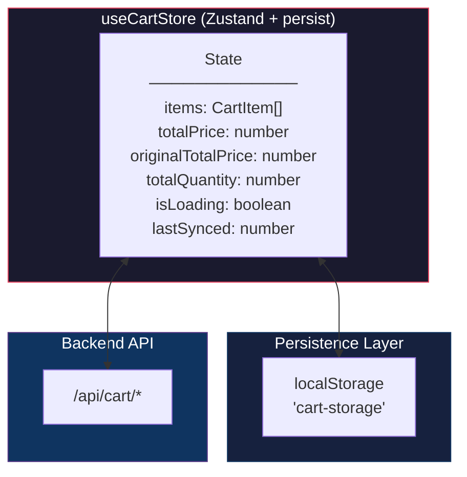
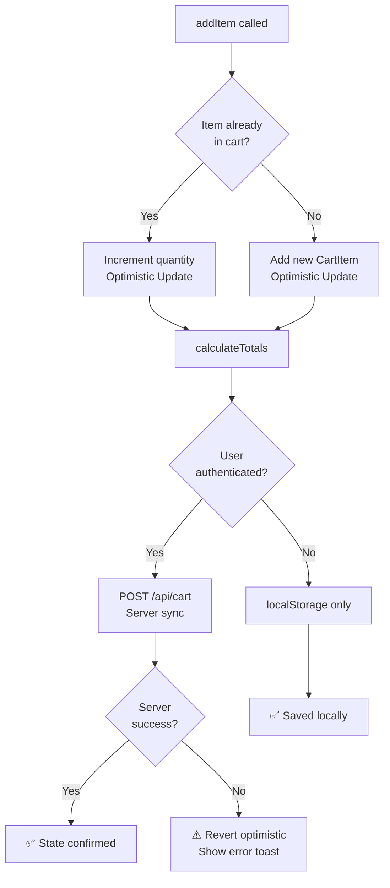
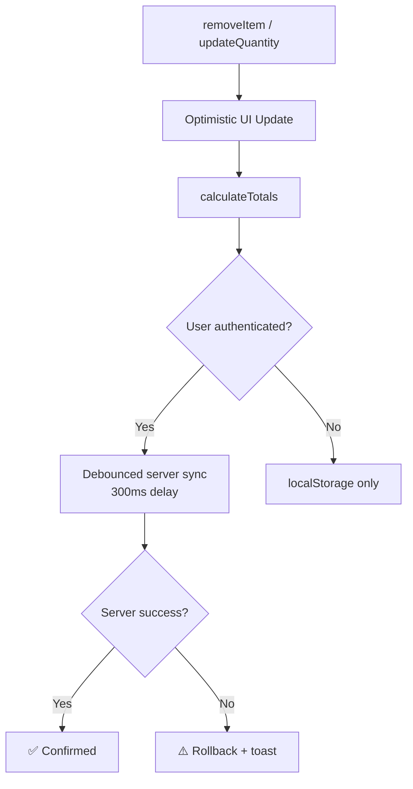
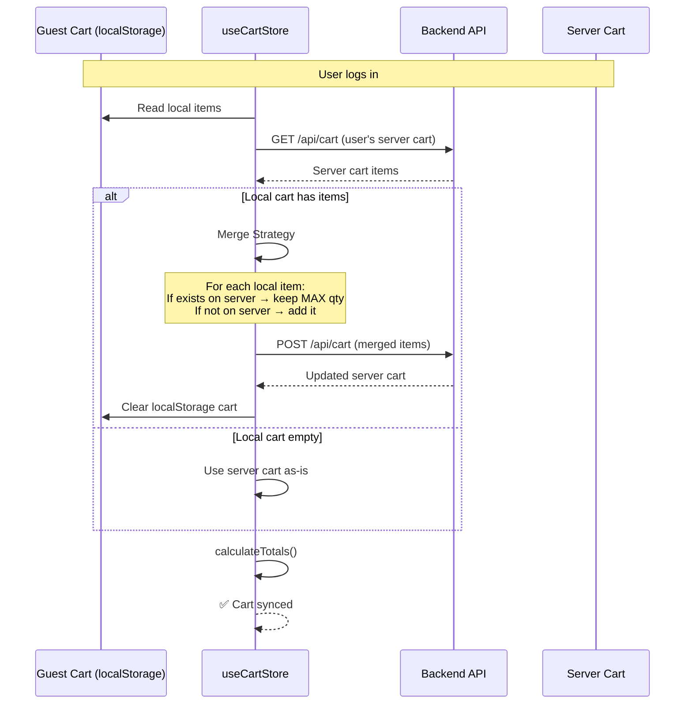
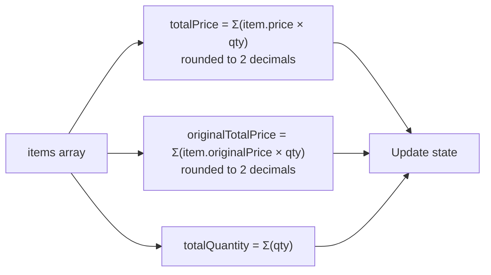

# Cart Store Architecture

> Zustand-based cart state management with localStorage persistence and server sync.

## State Architecture

## Add Item Flow

## Remove / Update Quantity Flow

## Guest → User Cart Merge

## Calculate Totals

