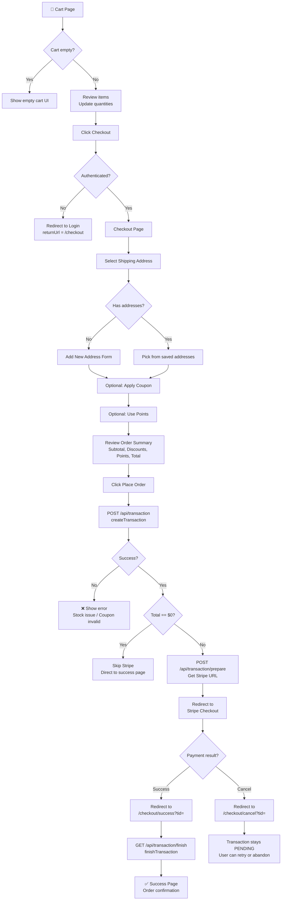
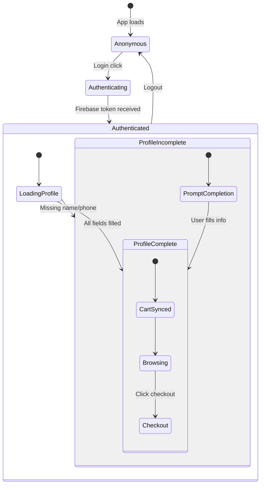
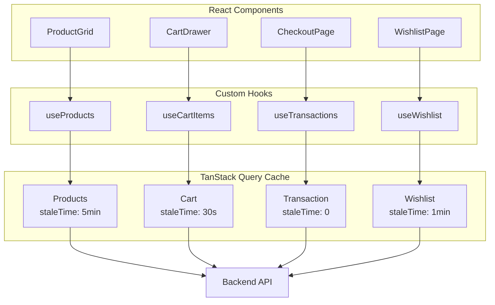

# Frontend Checkout Flow

> End-to-end user journey from cart to order confirmation.

## Full Checkout Journey

```mermaid
flowchart TD
    A[🛒 Cart Page] --> B{Cart empty?}
    B -- Yes --> B1[Show empty cart UI]
    B -- No --> C[Review items<br/>Update quantities]

    C --> D[Click Checkout]
    D --> E{Authenticated?}
    E -- No --> E1[Redirect to Login<br/>returnUrl = /checkout]
    E -- Yes --> F[Checkout Page]

    F --> G[Select Shipping Address]
    G --> G1{Has addresses?}
    G1 -- No --> G2[Add New Address Form]
    G1 -- Yes --> G3[Pick from saved addresses]

    G2 --> H[Optional: Apply Coupon]
    G3 --> H

    H --> I[Optional: Use Points]
    I --> J[Review Order Summary<br/>Subtotal, Discounts, Points, Total]

    J --> K[Click Place Order]
    K --> L[POST /api/transaction<br/>createTransaction]

    L --> M{Success?}
    M -- No --> M1[❌ Show error<br/>Stock issue / Coupon invalid]
    M -- Yes --> N{Total == $0?}

    N -- Yes --> O[Skip Stripe<br/>Direct to success page]
    N -- No --> P[POST /api/transaction/prepare<br/>Get Stripe URL]
    P --> Q[Redirect to<br/>Stripe Checkout]
    Q --> R{Payment result?}
    R -- Success --> S[Redirect to<br/>/checkout/success?tid=]
    R -- Cancel --> T[Redirect to<br/>/checkout/cancel?tid=]

    S --> U[GET /api/transaction/finish<br/>finishTransaction]
    U --> V[✅ Success Page<br/>Order confirmation]

    T --> W[Transaction stays PENDING<br/>User can retry or abandon]
```

## Auth State Flow

```mermaid
stateDiagram-v2
    [*] --> Anonymous : App loads
    Anonymous --> Authenticating : Login click
    Authenticating --> Authenticated : Firebase token received
    Authenticated --> Anonymous : Logout

    state Authenticated {
        [*] --> LoadingProfile
        LoadingProfile --> ProfileComplete : All fields filled
        LoadingProfile --> ProfileIncomplete : Missing name/phone

        state ProfileComplete {
            [*] --> CartSynced
            CartSynced --> Browsing
            Browsing --> Checkout : Click checkout
        }

        state ProfileIncomplete {
            [*] --> PromptCompletion
            PromptCompletion --> ProfileComplete : User fills info
        }
    }
```

## Data Fetching & Caching (TanStack Query)

```mermaid
flowchart TD
    subgraph TanStack["TanStack Query Cache"]
        PQ["Products<br/>staleTime: 5min"]
        CQ["Cart<br/>staleTime: 30s"]
        TQ["Transaction<br/>staleTime: 0"]
        WQ["Wishlist<br/>staleTime: 1min"]
    end

    subgraph Hooks["Custom Hooks"]
        H1[useProducts]
        H2[useCartItems]
        H3[useTransactions]
        H4[useWishlist]
    end

    subgraph Components["React Components"]
        C1[ProductGrid]
        C2[CartDrawer]
        C3[CheckoutPage]
        C4[WishlistPage]
    end

    H1 --> PQ
    H2 --> CQ
    H3 --> TQ
    H4 --> WQ

    C1 --> H1
    C2 --> H2
    C3 --> H3
    C4 --> H4

    PQ --> API["Backend API"]
    CQ --> API
    TQ --> API
    WQ --> API
```
